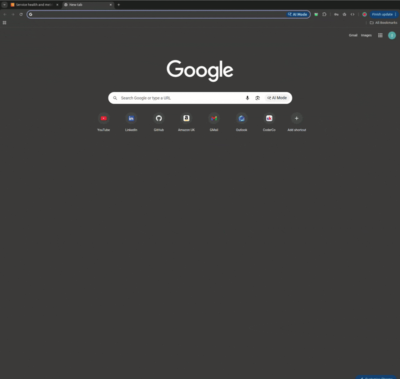
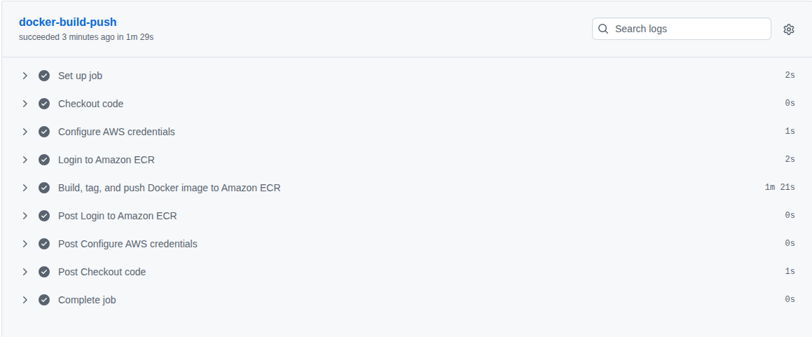
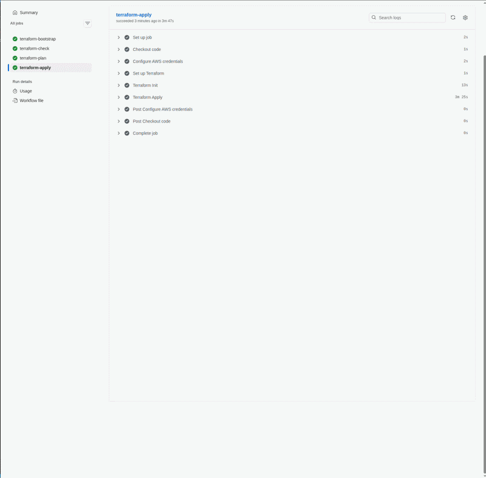
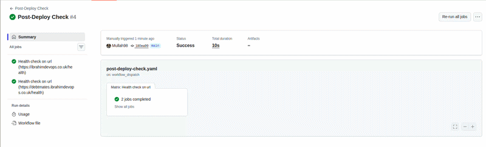

## DebtMates – Production Full-Stack App on AWS ECS (Fargate, Terraform, CI/CD)

Production-grade full-stack application containerised with **Docker** and deployed to **AWS ECS Fargate**. Infrastructure provisioned with **Terraform**, automated deployments via **GitHub Actions CI/CD pipeline**, and served securely over HTTPS with a custom domain.

## Table of Contents

- [Overview](#overview)
- [Tech Stack](#tech-stack)
- [Engineering Highlights](#engineering-highlights)
- [Architecture](#architecture)
- [Infrastructure Setup](#infrastructure-setup)
- [CI/CD Pipeline](#cicd-pipeline)
- [Cost Considerations](#cost-considerations)
- [Project Structure](#project-structure)
- [Running Locally](#running-locally)
- [Reflections](#reflections)

## Overview

**What this project demonstrates**

- Designing and deploying production-ready AWS infrastructure using Terraform
- Building a secure containerised application with Docker
- Implementing CI/CD pipelines with GitHub Actions
- Deploying scalable services using ECS Fargate behind an ALB
- Managing DNS and HTTPS with Cloudflare and ACM
- Applying security best practices (private subnets, IAM least privilege, HTTPS)

## Live Demo

| Environment| URL |
|------------|-----|
| Production | https://debtmates.ibrahimdevops.co.uk |

Demo walkthrough:



## Tech Stack

| Category | Technology |
|---|---|
| Frontend | Vite, React |
| Backend | Node.js, Express |
| Database & Auth | Supabase |
| Infrastructure | AWS ECS Fargate, ALB, ECR, VPC, NAT Gateway, ACM, CloudWatch, S3, DynamoDB |
| IaC | Terraform |
| CI/CD | GitHub Actions |
| Containerisation | Docker |
| DNS | Cloudflare |

## Engineering Highlights

- Reduced Docker image size from **219MB to 179MB** using a multi-stage build (**18% reduction**)
- End-to-end deployment from commit to live ECS service completes in **under 10 minutes** via CI/CD
- ECS tasks deployed in private subnets with no public IPs — only reachable via the ALB
- All traffic encrypted in transit via ACM-issued SSL certificate
- Least-privilege IAM roles scoped specifically to ECS task execution, following AWS security best practices
- Reduced manual deployment steps from ~15+ AWS Console actions to a single `git push` via CI/CD automation

## Architecture


### Request Flow

1. User accesses the application via custom domain
2. DNS (Cloudflare) resolves to AWS Application Load Balancer
3. Application Load Balancer terminates HTTPS using ACM certificate
4. Traffic is routed to ECS service target group
5. ECS Fargate task serves the application
6. Application communicates with Supabase for database and authentication

## Infrastructure Setup

All infrastructure is provisioned with Terraform and organised into reusable modules. The following AWS resources are created:

| Resource | Description |
|---|---|
| **VPC** | Custom VPC with public and private subnets across eu-west-2a and eu-west-2b |
| **NAT Gateway** | Allows ECS tasks in private subnets to make outbound internet requests |
| **Security Groups** | ALB SG (80/443 public), ECS SG (port 3000 from ALB only) |
| **ECR** | Container registry for the Docker image |
| **ECS Cluster** | Fargate cluster running the application as a single container service |
| **ALB** | Internet-facing load balancer with HTTP → HTTPS redirect |
| **ACM** | SSL certificate for the custom domain (DNS validated) |
| **IAM** | Least-privilege task execution role for ECS |
| **CloudWatch** | Log group `/ecs/app` for container logs |
| **S3 + DynamoDB** | Remote Terraform state storage and state locking |

---

### Security

- ECS tasks run in **private subnets** with no public IPs
- Only ALB security group can access ECS service
- HTTPS enforced using ACM certificate
- IAM roles to follow **least privilege principles**
- Secrets stored in GitHub Action secrets
- Terraform state secured with S3 + DynamoDB locking

---

### Scaling & Availability

- Deployed across **2 Availability Zones**
- ECS service can be scaled horizontally by increasing task count
- ALB distributes traffic across tasks
- Stateless container design allows easy scaling

> Screenshots of AWS resources created with Terraform [here](./infrastructure/README.md)


## CI/CD Pipeline

### 1. `docker-build-push-ecr.yaml` — Build & Push
Builds the Docker image and pushes it to Amazon ECR.



---

### 2. `terraform-deploy.yaml` — Infrastructure Provisioning
Bootstraps the Terraform backend (S3 + DynamoDB) and applies the necessary IAM policies before running `terraform fmt` (formatting), `terraform validate` (validation) and `tflint` (linting). Then executes `terraform init`, `terraform plan` and `terraform apply` to provision or update infrastructure. Remote state is stored in S3 with DynamoDB state locking.



---

### 3. `post-deploy-check.yaml` — Health Check
Only runs if the Terraform Deploy workflow completes with a success conclusion — skipped entirely on failure or cancellation. Hits the /health endpoint on both domains in parallel using a matrix strategy, with up to 5 retries and a 10 second timeout per request. Validates that the JSON response contains `"status": "ok"`, failing the pipeline if it doesn't.


---

### Required GitHub Secrets

| Secret | Description |
|---|---|
| `AWS_ACCESS_KEY_ID` | IAM user access key |
| `AWS_SECRET_ACCESS_KEY` | IAM user secret key |
| `AWS_REGION` | e.g. `eu-west-2` |
| `ECR_REGISTRY` | ECR registry URI |
| `ECR_REPOSITORY` | ECR repository name |
| `ECS_CLUSTER` | ECS cluster name |
| `ECS_SERVICE` | ECS service name |
| `VITE_SUPABASE_URL` | Supabase project URL |
| `VITE_SUPABASE_ANON_KEY` | Supabase anon key |

## Cost Considerations

- Fargate chosen for simplicity over EC2
- NAT Gateway is the main cost driver
- Single service and minimal compute used to keep costs low

## Project Structure

```
├── app/                        # Full-stack application
│   ├── Dockerfile
│   ├── docker-compose.yaml
│   └── .dockerignore
├── infra/                      # Terraform infrastructure
│   ├── modules/
│   │   ├── vpc/
│   │   ├── acm/
│   │   ├── ecr/
│   │   ├── ecs/
│   │   ├── alb/
│   │   └── iam/
│   ├── bootstrap/              # S3 + DynamoDB remote state backend
│   ├── main.tf
│   ├── variables.tf
│   ├── outputs.tf
│   ├── providers.tf
│   ├── backend.tf
│   └── terraform.tfvars
├── .github/
│   └── workflows/
│       ├── docker-build-push-ecr.yaml    # Build and push image to ECR
│       ├── terraform-deploy.yaml       # Terraform provisioning
│       └── post-deploy-check.yaml    # Post-deploy health check
└── README.md
```

## Running Locally

### Development
```bash
git clone https://github.com/Mullah98/DebtMates.git
npm install
```

Create a `.env` file with your Supabase credentials:
```bash
VITE_SUPABASE_URL=your_supabase_url
VITE_SUPABASE_ANON_KEY=your_supabase_anon_key
```
```bash
npm run dev
# → http://localhost:5173
```

---

### Production build
```bash
npm run build
node server.js
# → http://localhost:3000
```

### With Docker
```bash
docker compose up --build
# → http://localhost:3000
```

> For full setup instructions see the [app README](./app/README.md).

## Reflections

### Trade-offs

- **Fargate over EC2** - eliminates server management overhead at the cost of higher compute pricing. Right choice for a project of this scale.
- **Two Availability Zones** - adds resilience but increases cost, particularly with NAT Gateways provisioned per AZ.
- **NAT Gateway with Elastic IP** - keeps ECS tasks private with no public IPs while allowing outbound traffic to external services.
- **Remote state with S3 + DynamoDB** - storing Terraform state remotely rather than locally ensures the state is never lost and prevents concurrent runs from corrupting it via DynamoDB state locking.

---

### Challenges

- **Docker & Environment Variables** — Vite bundles env vars at build time, not runtime. Resolved by injecting Supabase credentials during the Docker build via Docker Compose.

- **ECS Health Checks Timing Out** — ECS tasks were marked unhealthy due to a security group misconfiguration. The task SG only allowed TCP 80, but the app listens on port 3000. Fixed by restricting inbound TCP 3000 to the ALB security group only.

- **ACM Certificate Validation with Cloudflare** — Both `ibrahimdevops.co.uk` and `*.ibrahimdevops.co.uk` share the same ACM validation record, causing duplicate CNAME errors in Cloudflare. Resolved by using the `...` ellipsis operator in the Terraform `for_each` loop to deduplicate validation records.

- **Terraform State Lock Contention** — Concurrent pipeline runs caused DynamoDB lock conflicts. Fixed by adding a `concurrency` block to the Terraform workflow.

- **Plan/Apply Consistency** — Persisted the Terraform plan as a `tfplan` artifact to guarantee the apply step executes exactly what was reviewed in the plan.

- **IAM Permissions** — Iteratively scoped permissions for the ECS task execution role and CI/CD OIDC role as Terraform surfaced missing permissions across modules.

### Future Improvements

- Add ECS autoscaling policies based on CPU/Memory
- Move secrets to AWS Secrets Manager for runtime injection
- Replace NAT Gateway with VPC endpoints to reduce costs
- Implement blue/green deployments for zero downtime releases
