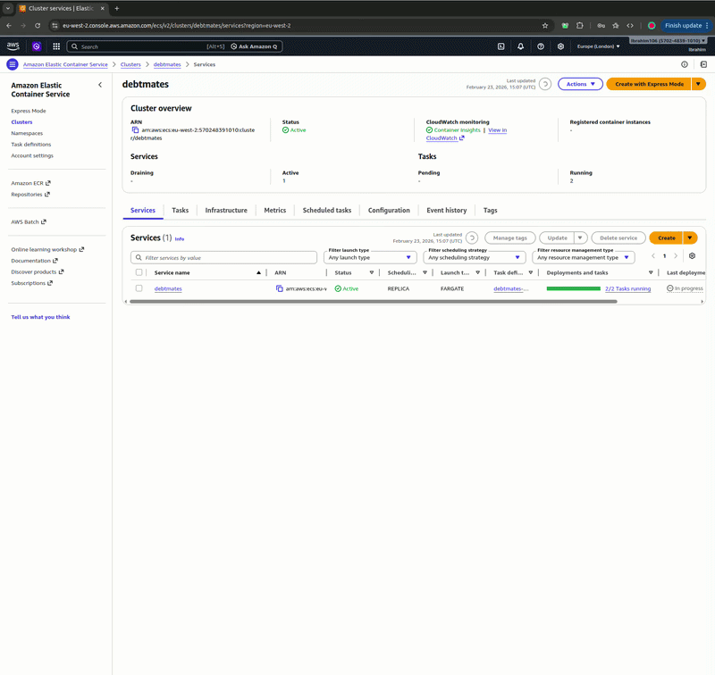

## AWS Infrastructure screenshots with Terraform

### Application Load Balancer Resource Map

### ALB Target Groups

### ECR Repository

### ECS Cluster

### ECS Tasks Running

### ECS Cloudwatch Logs
